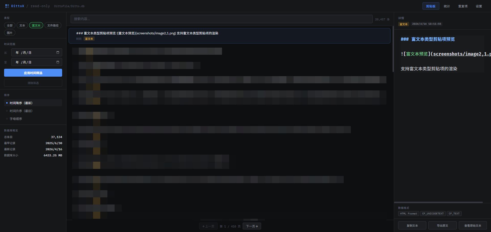

# Ditto X

一个用于浏览和检索 Ditto 剪贴板管理器数据库（Ditto.db）的本地 Web 应用。后端采用 Python。

## 功能特性

- 列表浏览：分页、类型徽标、置顶标记、相对时间显示
- 搜索与过滤：全文搜索、类型筛选（文本/HTML/图片/文件/RTF）、时间范围、排序（最新/最旧/字母）
- 详情面板：原文/图片预览、带格式文本预览、格式列表、复制文本、导出原文或图片
- 统计面板：存储空间占用、总体计数、过去 30 天活跃度、过去 7 天趋势、小时分布、最近 24 小时分布、活跃天数与日均复制
- 数据清洗：按照大小、时间范围、类型等条件清洗数据，删除历史无用项
- 多数据库路径管理：添加/切换/删除路径，配置持久化到 settings.json

## 界面预览

### 剪贴板列表


分页浏览剪贴项，显示类型徽标和时间，支持搜索和过滤。

### 图片类型剪贴项预览


支持图片类型剪贴项的预览和全屏查看

### 带格式文本类型剪贴项预览



支持带格式文本类型剪贴项的渲染

### 剪贴项统计


展示总体计数、30 天活跃度、7 天趋势、小时分布等统计数据。

## 项目结构

- assets/
  - ditto-x.ico（托盘图标）
- python/
  - app.py（托盘主程序） [app.py](file:///e:/Fun/code/ditto-x-1/python/app.py)
  - server.py（后端服务） [server.py](file:///e:/Fun/code/ditto-x-1/python/server.py)
  - templates/
    - index.html（前端单页） [index.html](file:///e:/Fun/code/ditto-x-1/python/templates/index.html)
- LICENSE（GPL-3.0）

## 运行环境

- 操作系统：Windows
- 依赖：Python 3.10+，Flask，pystray，PyInstaller（可选）
- 默认端口：53980（HTTP），53981（单实例锁）

## 快速开始

1. 安装依赖

```bash
pip install -r python/requirements.txt
```

1. 指定 Ditto 数据库路径（任选其一）

- 启动后在“设置”页添加并切换到你的 Ditto.db
- 或设置环境变量 DITTO\_DB 指向 Ditto.db（未配置时默认 E:/DittoFile/Ditto.db）

1. 启动服务

```bash
python python/server.py
```

启动后程序会：

- 在 127.0.0.1:53980 提供 Web 界面
- 自动打开浏览器与系统托盘图标
- 已运行实例被检测到时，仅打开浏览器指向现有服务

## 核心能力

- 类型识别：根据 Data 表格式（CF\_UNICODETEXT/CF\_TEXT/HTML Format/Rich Text Format/CF\_HDROP/PNG/CF\_DIB）推断为文本、RTF、文件或图片
- 文本展示：优先 UNICODETEXT → HTML 清洗 → RTF 清洗 → CF\_TEXT → Main.mText
- 图片处理：优先返回 PNG；如仅有 CF\_DIB，尝试补齐 BMP 文件头并规避透明度导致的"黑图"问题；导出为 PNG 或 BMP

## 四种数据类型的查询逻辑

系统将剪贴板数据分为 **文本（text）**、**富文本（richtext）**、**图片（image）**、**文件路径（file）** 四大类。类型识别基于 `Main.mText` 字段与 `Data` 表中 `strClipBoardFormat` 格式标记的组合判断，查询过滤则通过子查询匹配对应的剪贴板格式。

### 1. 文本（text）

**识别条件**（`detect_clip_type` 函数）：

- Data 表中包含 `CF_UNICODETEXT` 或 `CF_TEXT` 格式
- Data 表中**不包含** `HTML Format` 和 `CF_HDROP` 格式
- 即：纯文本，无富文本标记、无文件拖放、无图片数据

**SQL 过滤条件**（`_type_filter_sql('text')`）：

```sql
AND (
    (lID IN (SELECT lParentID FROM Data WHERE strClipBoardFormat = 'CF_UNICODETEXT')
    OR lID IN (SELECT lParentID FROM Data WHERE strClipBoardFormat = 'CF_TEXT'))
    AND lID NOT IN (SELECT lParentID FROM Data WHERE strClipBoardFormat IN ('HTML Format','CF_HDROP'))
)
```

**文本展示优先级**（`get_best_text` 函数）：

1. `CF_UNICODETEXT` → UTF-16-LE 解码，去除尾部 `\x00\x00`
2. `CF_TEXT` → 多编码尝试解码（utf-8 → gbk → gb18030 → cp1252 → latin-1）
3. `Main.mText` 字段（排除 `mText == 'CF_DIB'`）
4. 兜底返回 `[No Text]`

### 2. 富文本（richtext）

**识别条件**：

- Data 表中同时包含 `CF_UNICODETEXT`/`CF_TEXT` **和** `HTML Format` 格式
- Data 表中**不包含** `PNG` 格式（排除PPT文档复制成图片）
- 覆盖了原 html 和 rtf 两种类型

**SQL 过滤条件**（`_type_filter_sql('richtext')`）：

```sql
AND (
    (mText = 'HTML Format' AND lID IN (SELECT lParentID FROM Data WHERE strClipBoardFormat = 'HTML Format'))
    OR (lID IN (SELECT lParentID FROM Data WHERE strClipBoardFormat = 'HTML Format')
    AND (lID IN (SELECT lParentID FROM Data WHERE strClipBoardFormat = 'CF_TEXT')
    OR lID IN (SELECT lParentID FROM Data WHERE strClipBoardFormat = 'CF_UNICODETEXT'))
    AND lID NOT IN (SELECT lParentID FROM Data WHERE strClipBoardFormat IN ('PNG')))
)
```

**文本展示优先级**：

1. `CF_UNICODETEXT` → UTF-16-LE 解码
2. `CF_TEXT` → 多编码尝试解码
3. `HTML Format` → 正则去除 HTML 标签，清洗空白字符
4. 兜底返回 `mText` 或 `[Rich Text]`

**详情页额外数据**：`api_clip_detail` 接口会额外返回 `html_raw` 字段（原始 HTML 内容），供前端渲染富文本预览。

### 3. 图片（image）

图片类型包含三个子类型，前端统一以 `image` 参数查询：

| 子类型               | 识别条件                                                                 | 说明                     |
| ----------------- | -------------------------------------------------------------------- | ---------------------- |
| **web\_image**    | Data 表包含 `PNG` 格式                                                    | 从网页复制的图片               |
| **copied\_image** | Data 表同时包含 `CF_DIB` 和 `CF_HDROP`                                     | 从本地软件复制的图片（如QQ/微信群聊赋值） |
| **screenshot**    | `mText == 'CF_DIB'` 且 Data 表包含 `CF_DIB`，不含 PNG/CF\_HDROP/HTML Format | 截图                     |

**SQL 过滤条件**（`_type_filter_sql('image')`，合并三个子类型）：

```sql
AND (
    (
        (lID IN (SELECT lParentID FROM Data WHERE strClipBoardFormat='CF_DIB')
        AND lID IN (SELECT lParentID FROM Data WHERE strClipBoardFormat IN ('CF_HDROP','PNG')))
        OR (mText = 'CF_DIB' AND (lID IN (SELECT lParentID FROM Data WHERE strClipBoardFormat='CF_DIB')))
    )
)
```

**文本展示逻辑**：

- `web_image` / `screenshot` → 返回 `[Image]`
- `copied_image` → 从 `mText` 解析文件名，返回 `[Image] {文件名}`（mText 格式为 `Copied File - {文件名}`）

**图片数据获取**（`get_image_data` 函数）：

1. 优先查询 `PNG` 格式数据 → 直接返回 `image/png`
2. 查询 `CF_DIB` 格式数据 → 判断是否为 BMP（以 `BM` 开头直接返回）
3. CF\_DIB 非 BMP → 解析 BITMAPINFOHEADER，补齐 BMP 文件头；对 32 位色深强制设置 Alpha=255（修复透明度导致的黑图问题） → 返回 `image/bmp`

### 4. 文件路径（file\_path）

**识别条件**：

- Data 表包含 `CF_HDROP` 格式（文件拖放格式）
- Data 表**不包含** `CF_DIB` 和 `PNG` 格式（排除含图片的拖放）
- `mText` 通常以 `Copied File` 开头

**SQL 过滤条件**（`_type_filter_sql('file')`）：

```sql
AND (
    (lID IN (SELECT lParentID FROM Data WHERE strClipBoardFormat='CF_HDROP')
    AND lID NOT IN (SELECT lParentID FROM Data WHERE strClipBoardFormat IN ('CF_DIB','PNG')))
)
```

**文本展示逻辑**：

1. 优先解析 `CF_HDROP` 二进制数据 → `parse_hdrop` 函数解析文件路径列表，多路径以换行拼接
2. 从 `mText` 提取路径（格式为 `Copied File - {描述} - {路径}`）
3. 兜底返回 `[File]`

**CF\_HDROP 解析**（`parse_hdrop` 函数）：

- 读取偏移量（前 4 字节，小端序 uint32）
- 判断宽字符标志（第 16 字节偏移的 uint32，非 0 为 UTF-16-LE，0 为 MBCS）
- 从偏移位置开始解码，按 `\x00` 分割得到路径列表

### 类型判断优先级顺序

`detect_clip_type` 函数按以下优先级依次判断，命中即返回：

1. `web_image`（有 PNG）
2. `copied_image`（有 CF\_DIB + CF\_HDROP）
3. `screenshot`（mText == 'CF\_DIB' 且有 CF\_DIB）
4. `file`（有 CF\_HDROP，无 CF\_DIB/PNG）
5. `richtext`（有 CF\_UNICODETEXT/CF\_TEXT + HTML Format）
6. `text`（有 CF\_UNICODETEXT/CF\_TEXT，无 HTML Format/RTF）
7. 兜底 `text`（mText 非空且非 'CF\_DIB'）

> **注意**：`copied_image` 和 `file` 的 mText 都可能以 `Copied File` 开头，区分关键在于是否包含 `CF_DIB` 格式——有 CF\_DIB 为图片，无 CF\_DIB 为文件路径。

## 常用接口

- GET /api/clips：分页列表
  - 参数：page、page\_size、q、type、date\_from、date\_to、sort、pinned
- GET /api/clip/{id}：单条详情（含格式列表与 HTML 原文）
- GET /api/clip/{id}/image：图片字节流（PNG/BMP）
- GET /api/stats：计数与时序统计
- GET /api/duplicates：重复项分组（按 CRC）
- GET /api/timeline：日历视图聚合
- GET /api/search/suggest：搜索联想
- GET /api/db/info：当前数据库文件信息
- POST /api/cleanup/preview：清理预览（body: { rules: \[] }）
- POST /api/cleanup/run：执行清理（body: { rules: \[] }）
- GET /api/config：获取配置（db\_paths/current\_path）
- POST /api/config/path：添加并切换路径（body: { path }）
- POST /api/config/switch：切换当前路径（body: { path }）
- DELETE /api/config/path：移除路径（query: path）

## 打包可执行文件（可选）

已适配 PyInstaller 的资源路径处理（sys.\_MEIPASS）。示例命令（根据需要调整）：

```bash
python python/build_exe.py
```

## 注意事项

- 本项目仅提供只读浏览、检索与导出，不对 Ditto 数据库进行写入
- 请确保 Ditto.db 路径正确且可读；如路径包含中文或空格，建议在“设置”页添加并切换
- 如果端口被占用，请修改 server.py/app.py中的端口或释放占用端口

## 许可证

本项目采用 GPL-3.0 许可证，详见 [LICENSE](file:///e:/Fun/code/ditto-x-1/LICENSE)。
