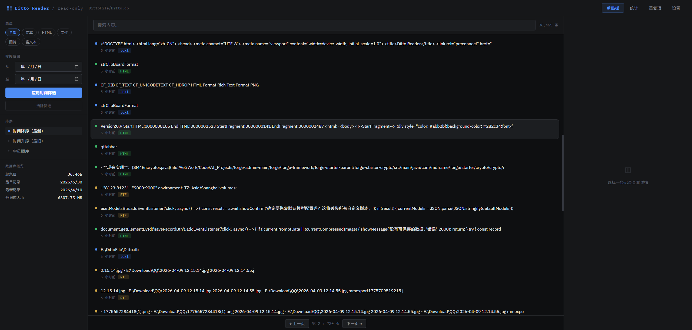
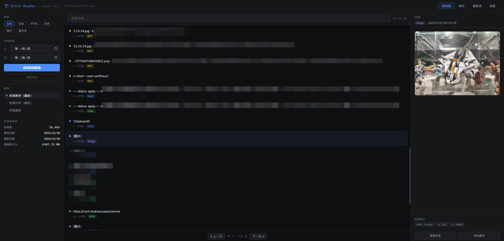
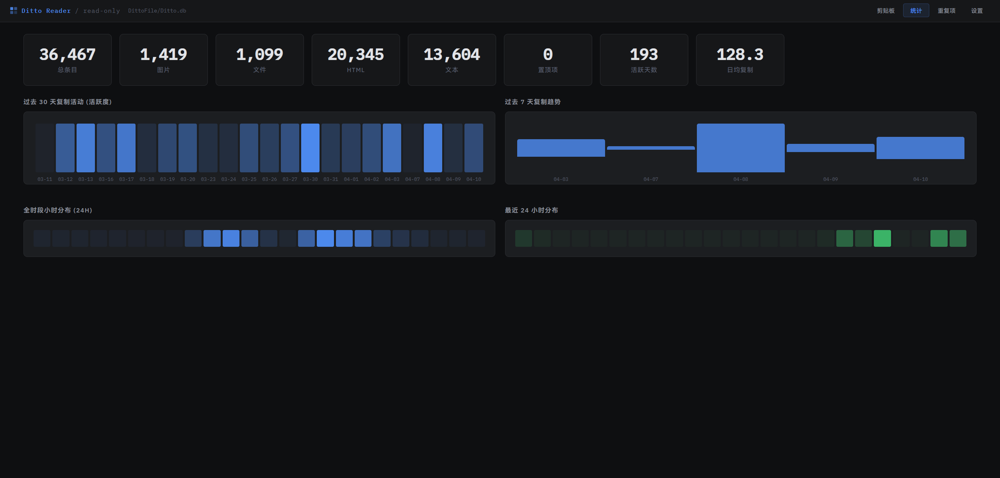

# Ditto X

一个用于浏览和检索 Ditto 剪贴板管理器数据库（Ditto.db）的本地 Web 应用。后端采用 Python，前端为零依赖的静态页面。应用以只读方式打开数据库，确保数据安全。

## 功能特性

- 只读访问 Ditto 的 SQLite 数据库（开启 PRAGMA query\_only 与 URI mode=ro）
- 列表浏览：分页、类型徽标、置顶标记、相对时间显示
- 搜索与过滤：全文搜索、类型筛选（文本/HTML/图片/文件/RTF）、时间范围、排序（最新/最旧/字母）
- 详情面板：原文/图片预览、格式列表、复制文本、导出原文或图片
- 统计面板：总体计数、过去 30 天活跃度、过去 7 天趋势、小时分布、最近 24 小时分布、活跃天数与日均复制
- <br />
- 多数据库路径管理：添加/切换/删除路径，配置持久化到 settings.json

## 界面预览

### 剪贴板列表



分页浏览剪贴项，显示类型徽标和时间，支持搜索和过滤。

### 图片类型剪贴项预览



支持图片类型剪贴项的预览和全屏查看

### 剪贴项统计



展示总体计数、30 天活跃度、7 天趋势、小时分布等统计数据。

## 项目结构

- assets/
  - ditto-x.ico（托盘图标）
- python/
  - app.py（后端与托盘主程序） [app.py](file:///e:/Fun/code/ditto-x-1/python/app.py)
  - templates/
    - index.html（前端单页） [index.html](file:///e:/Fun/code/ditto-x-1/python/templates/index.html)
- LICENSE（GPL-3.0）

## 运行环境

- 操作系统：Windows
- 依赖：Python 3.10+，Flask，pystray，PyInstaller（可选）
- 默认端口：53980（HTTP），53981（单实例锁）

## 快速开始

1. 安装依赖

```bash
pip install -r python/requirements.txt
```

1. 指定 Ditto 数据库路径（任选其一）

- 启动后在“设置”页添加并切换到你的 Ditto.db
- 或设置环境变量 DITTO\_DB 指向 Ditto.db（未配置时默认 E:/DittoFile/Ditto.db）

1. 启动服务

```bash
python python/app.py
```

启动后程序会：

- 在 127.0.0.1:53980 提供 Web 界面
- 自动打开浏览器与系统托盘图标
- 已运行实例被检测到时，仅打开浏览器指向现有服务

## 核心能力说明

- 类型识别：根据 Data 表格式（CF\_UNICODETEXT/CF\_TEXT/HTML Format/Rich Text Format/CF\_HDROP/PNG/CF\_DIB）推断为文本、HTML、RTF、文件或图片
- 文本展示：优先 UNICODETEXT → HTML 清洗 → RTF 清洗 → CF\_TEXT → Main.mText
- 图片处理：优先返回 PNG；如仅有 CF\_DIB，尝试补齐 BMP 文件头并规避透明度导致的“黑图”问题；导出为 PNG 或 BMP
- 只读保障：数据库以 file:<path>?mode=ro 方式连接，并开启 PRAGMA query\_only

## 常用接口

- GET /api/clips：分页列表
  - 参数：page、page\_size、q、type、date\_from、date\_to、sort、pinned
- GET /api/clip/{id}：单条详情（含格式列表与 HTML 原文）
- GET /api/clip/{id}/image：图片字节流（PNG/BMP）
- GET /api/stats：计数与时序统计
- GET /api/duplicates：重复项分组（按 CRC）
- GET /api/timeline：日历视图聚合
- GET /api/search/suggest：搜索联想
- GET /api/db/info：当前数据库文件信息
- GET /api/config：获取配置（db\_paths/current\_path）
- POST /api/config/path：添加并切换路径（body: { path }）
- POST /api/config/switch：切换当前路径（body: { path }）
- DELETE /api/config/path：移除路径（query: path）

## 打包可执行文件（可选）

已适配 PyInstaller 的资源路径处理（sys.\_MEIPASS）。示例命令（根据需要调整）：

```bash
pyinstaller -F ^
  --name DittoX ^
  --add-data "python/templates;python/templates" ^
  --add-data "assets;assets" ^
  python/app.py
```

## 注意事项

- 本项目仅提供只读浏览、检索与导出，不对 Ditto 数据库进行写入
- 请确保 Ditto.db 路径正确且可读；如路径包含中文或空格，建议在“设置”页添加并切换
- 如果端口被占用，请修改 app.py 中的端口或释放占用端口

## 许可证

本项目采用 GPL-3.0 许可证，详见 [LICENSE](file:///e:/Fun/code/ditto-x-1/LICENSE)。
